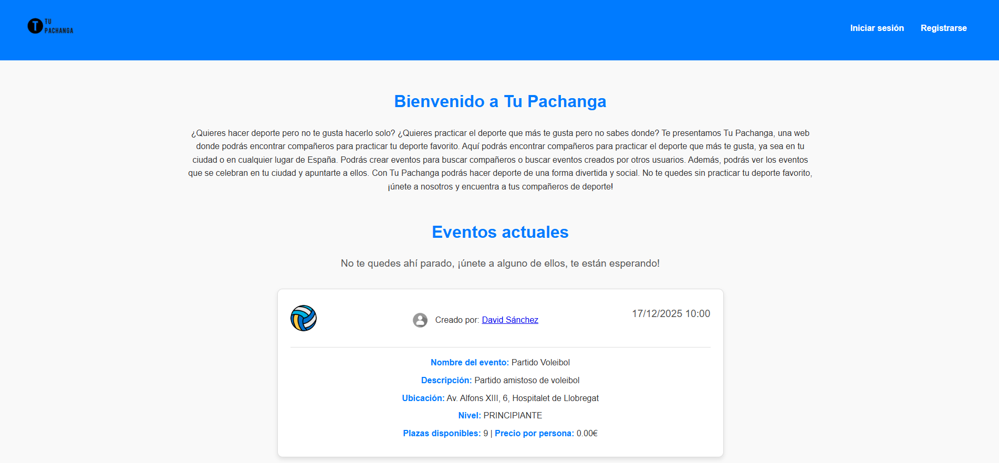
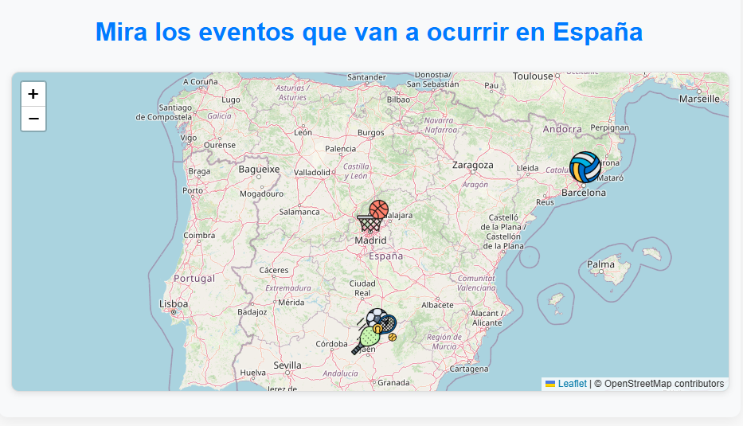
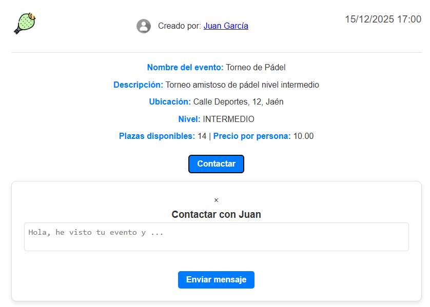
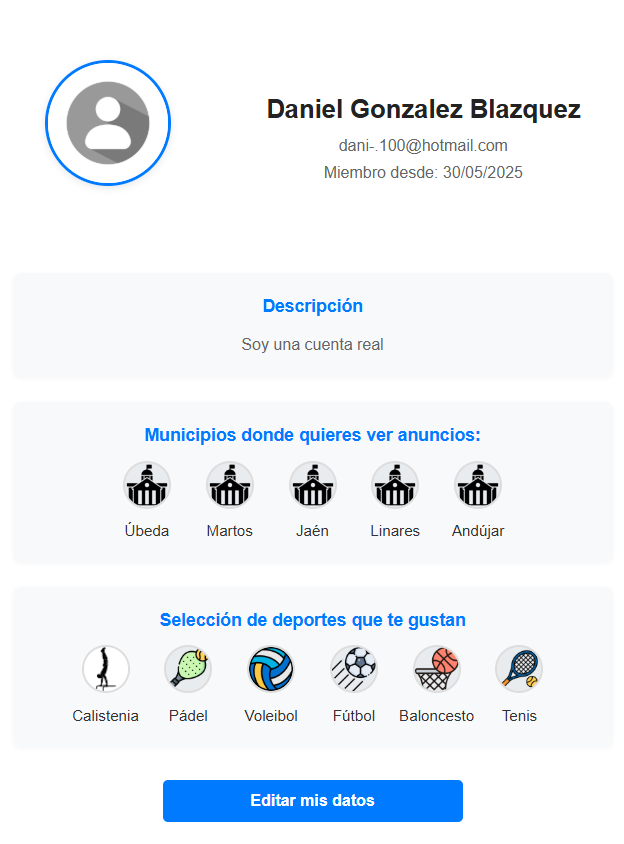

# 🏀 TuPachanga

**TuPachanga** es una aplicación web desarrollada con Spring Boot que permite a los usuarios registrarse, descubrir, crear y gestionar eventos deportivos en España, con integración de mapa interactivo para visualizar dónde se celebran.

---

## 📸 Pantallas de la aplicación

Capturas de pantallas de algunas funcionalidades de la aplicación.



---

## 🚀 Características principales

- Registro e inicio de sesión de usuarios con Spring Security
- Personalización de perfil: avatar, deportes favoritos, municipios, ...
- Publicación y gestión de eventos deportivos
- Visualización de eventos en un mapa interactivo (Leaflet.js)
- Solicitudes para unirse a eventos
- Página principal con eventos destacados

---

## 🧱 Tecnologías utilizadas

- **Backend:** Java 21, Spring Boot, Spring Security, Spring Data JPA
- **Frontend:** Thymeleaf, HTML5, CSS3, JavaScript, Leaflet.js
- **Base de datos:** PostgreSQL
- **Otros:** Maven, BCrypt, Bootstrap, Docker

---

## 🏛️ Arquitectura

El proyecto sigue el patrón MVC (Modelo-Vista-Controlador). Estructura de paquetes:

```
📦tupachanga
 ┣ 📂config
 ┣ 📂controllers
 ┣ 📂dtos
 ┣ 📂entities
 ┣ 📂repositories
 ┣ 📂security
 ┣ 📂services
 ┗ 📜TuPachangaApplication.java
```

---

## 🔐 Seguridad

- Login y logout gestionado por Spring Security
- Contraseñas encriptadas con BCrypt
- Acceso restringido a funcionalidades según autenticación
- Sin JWT (funciona con sesión)

---

## 📁 Rutas principales

| Método | Ruta                       | Descripción                                           |
|--------|----------------------------|-------------------------------------------------------|
| GET    | `/`                        | Index pública con eventos aleatorios a nivel nacional |
| GET    | `/auth/register`           | Formulario de registro                                |
| POST   | `/auth/register`           | Registro de usuario                                   |
| GET    | `/auth/login`              | Formulario de login                                   |
| GET    | `/user/personalized-index` | Index personalizado tras login                        |
| POST   | `/user/contact-owner/{id}` | Enviar solicitud al creador del evento                
| GET    | `/user/profile`            | Muestra perfil del usuario logueado                   
| POST   | `/user/update-profile`     | Actualiza perfil del usuario logueado                 
| GET    | `/user/{uuid}`             | Muestra perfil del creador del evento                 
| GET    | `/match/new-match`         | Crear nuevo evento                                    |
| GET    | `/match/match-creation`    | Registro del nuevo evento                             |
| GET    | `/match/user-list`         | Ver eventos del usuario                               |
| POST   | `/match/update`            | Modificar evento                                      |
| POST   | `/match/delete`            | Eliminar evento                                       |

---

## 🧪 Validaciones y DTOs

- Validación de campos con anotaciones como `@NotBlank`, `@Email`, `@Pattern`, etc.
- Uso de DTOs para manejar los formularios y la entrada del usuario

---

## 👤 Autor

**Daniel González Blázquez** – [@danigb4](https://github.com/danigb4)

Proyecto desarrollado como parte del trabajo final del ciclo formativo de desarrollo de aplicaciones web.
